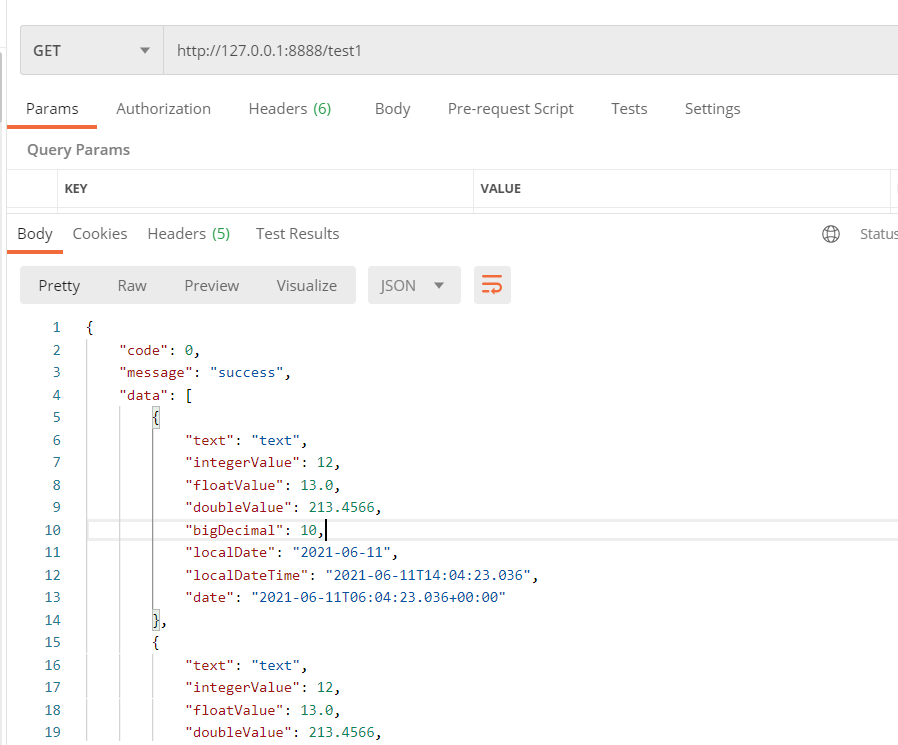
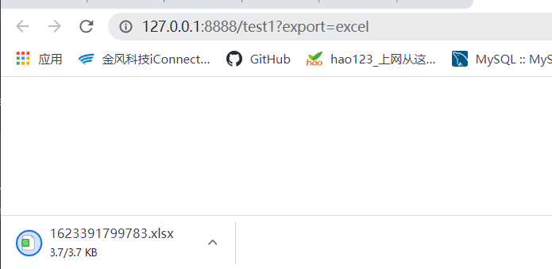

# easy-excel-plus

<p align="center">
  为简化开发工作、提高生产率而生
</p>

<p align="center">
  <a href="https://search.maven.org/search?q=g:com.gongbo%20a:easy-excel-*">
    
  </a>

  <a href="https://www.apache.org/licenses/LICENSE-2.0">
    
  </a>
</p>

# 简介 | Intro

EasyExcel 增强工具包 - 只做增强不做改变，简化导入，导出操作

技术讨论 QQ 群 ： 779290098

# 优点 | Advantages

- **无侵入**：EasyExcelPlus 在 EasyExcel 的基础上进行扩展，只做增强不做改变，引入 EasyExcelPlus 不会对您现有的 EasyExcel 构架产生任何影响，而且 EasyExcelPlus 支持所有 EasyExcel 原生的特性
- **依赖少**：仅仅依赖 EasyExcel


# Latest Version: [](https://search.maven.org/search?q=g:com.gongbo%20a:easy-excel-plus*)

``` xml
<dependency>
    <groupId>io.github.gongbox</groupId>
    <artifactId>easy-excel-plus</artifactId>
    <version>Latest Version</version>
</dependency>
```

#使用示例：
####模型类
```java
@Data
public class ExportDemoView {
    @ExcelProperty
    private String text = "text";
    @ExcelProperty
    private Integer integerValue = 12;
    @ExcelProperty
    private Float floatValue = 13.0f;
    @ExcelProperty
    private Double doubleValue = 213.4566;
    @ExcelProperty
    private BigDecimal bigDecimal = BigDecimal.TEN;
    @ExcelProperty
    private LocalDate localDate = LocalDate.now();
    @ExcelProperty
    private LocalDateTime localDateTime = LocalDateTime.now();
    @ExcelProperty
    private Date date = new Date();

    public static List<ExportDemoView> data() {
        return Stream.generate(ExportDemoView::new)
                .limit(new Random().nextInt(10))
                .collect(Collectors.toList());
    }
}
```
####配置文件
```yaml
server:
  port: 8888

excel-plus:
  export:
    responseClassName: com.gongbo.excel.example.result.Result
```
如下为一个普通查询接口：
```java
@GetMapping(value = "test1")
public Result<List<ExportDemoView>> test1() {
    return Result.success(ExportDemoView.data());
}
```
返回数据如下：

若需要开启导出，只需要在接口上增加注解@EnableExport即可，如下：
```java
@GetMapping(value = "test1")
@EnableExport
public Result<List<ExportDemoView>> test1() {
    return Result.success(ExportDemoView.data());
}
```
此时，接口依然可以正常查询，如果想导出，只需要请求接口时添加参数export=excel即可，如下所示：

通过上面的例子，可以发现，通过使用注解的方式，使得查询接口除了查询数据外，同时也支持导出，极大
地简化了导出开发
当然，实际中我们可能还有很多地方都需要定制，比如导出文件名，导出文件格式，根据模版导出，导出数据转换，同一接口多种导出等等。
EasyExcelPlus同样支持多种多样的自定义配置。

- 导出到固定文件夹：
    ```java
    @GetMapping(value = "test2")
    @EnableExport(outputPath = "D:\\WorkDir\\temp\\file")
    public Result<List<ExportDemoView>> test2() {
        return Result.success(ExportDemoView.data());
    }
    ```
- 导出-固定文件名称：
    ```java
    @GetMapping(value = "test3")
    @EnableExport(fileName = "文件名称")
    public Result<List<ExportDemoView>> test3() {
        return Result.success(ExportDemoView.data());
    }
    ```
- 导出-动态设置文件名称：
    ```java
    @GetMapping(value = "test4")
    @EnableExport(fileNameConvert = CustomFileNameConvert.class)
    public Result<List<ExportDemoView>> test4() {
        return Result.success(ExportDemoView.data());
    }
    public static class CustomFileNameConvert implements FileNameConvert {
        @Override
        public String apply(String fileName) {
            return LocalDate.now().format(DateTimeFormatter.BASIC_ISO_DATE);
        }
    }
    ```
    或者
    ```java
    @GetMapping(value = "test4")
    @EnableExport
    public Result<List<ExportDemoView>> test4() {
        if (ExportContextHolder.isExportExcel()) {
            ExportContextHolder.getContext().setFileName("动态文件名称");
        }
        return Result.success(ExportDemoView.data());
    }
    ```
- 导出-固定Sheet名称：
    ```java
    @GetMapping(value = "test5")
    @EnableExport(sheetName = "Sheet0")
    public Result<List<ExportDemoView>> test5() {
        return Result.success(ExportDemoView.data());
    }
    ```
- 导出-动态设置Sheet名称：
    ```java
    @GetMapping(value = "test6")
    @EnableExport
    public Result<List<ExportDemoView>> test6() {
        if (ExportContextHolder.isExportExcel()) {
             ExportContextHolder.getContext().setSheetName("业务中修改Sheet名称");
        }
        return Result.success(ExportDemoView.data());
    }
    ```
- 导出-字段过滤：
    ```java
    @GetMapping(value = "test7")
    @EnableExport(fieldFilter = CustomFieldFilter.class)
    public Result<List<ExportDemoView>> test7() {
        return Result.success(ExportDemoView.data());
    }
    public static class CustomFieldFilter implements FieldFilter {
        @Override
        public boolean predict(Field field) {
            return RandomUtil.randomBoolean();
        }
    }
    ```
- 导出-设置导出文件格式：
    ```java
    @GetMapping(value = "test8")
    @EnableExport(excelType = ExcelType.XLS)
    public Result<List<ExportDemoView>> test8() {
        return Result.success(ExportDemoView.data());
    }
    ```
- 导出-数据转换：
    ```java
    @GetMapping(value = "test9")
    @EnableExport(dataConvert = CustomExportDataConvert.class)
    public Result<List<ExportDemoView>> test9() {
        return Result.success(ExportDemoView.data());
    }
    public static class CustomExportDataConvert implements ExportDataConvert {
        @Override
        public List<?> convert(ExportContext exportContext, Object data) {
            Result<?> responseEntity = (Result<?>) data;
            List<ExportDemoView> list = (List<ExportDemoView>) responseEntity.getData();
            for (int i = 0; i < 20; i++) {
                list.add(new ExportDemoView());
            }
            return list;
        }
    }
    ```
- 导出-同一接口多种导出方式：
    ```java
    @GetMapping(value = "test10")
    @EnableExport(tag = "xls", excelType = ExcelType.XLS)
    @EnableExport(tag = "xlsx", excelType = ExcelType.XLSX)
    public Result<List<ExportDemoView>> test10() {
        return Result.success(ExportDemoView.data());
    }
    ```
   同一接口可以添加多个注解，以实现支持多种导出，通过注解tag属性设置标签，导出时，需要增使用参数export_tag指定标签
   如以上接口，需要导出格式为XLS，则导出接口为：
   - http://IP:端口号/test10?export=excel&export_tag=xls
   需要导出格式为XLSX，则导出接口为：
   - http://IP:端口号/test10?export=excel&export_tag=xlsx
- 导出-模版导出（单个Sheet）：
    ```java
    @GetMapping(value = "test11")
    @EnableExport(template = "template1.xls", dataConvert = Template1DataConvert.class)
    public Result<List<ExportDemoView>> test11() {
        return Result.success(ExportDemoView.data());
    }
    public static class Template1DataConvert implements ExportDataConvert {
        @Override
        public List<?> convert(ExportContext exportContext, Object data) {
            Result<?> responseEntity = (Result<?>) data;

            ExportFillData exportFillData1 = ExportFillData.builder()
                    .data(responseEntity.getData())
                    .build();

            Map<String, String> map = new HashMap<>();

            map.put("name", "名称");
            map.put("date_start", LocalDate.now().format(DateTimeFormatter.BASIC_ISO_DATE));
            map.put("date_end", LocalDate.now().format(DateTimeFormatter.BASIC_ISO_DATE));
            ExportFillData exportFillData2 = ExportFillData.builder()
                    .data(map)
                    .build();

            return Lists.newArrayList(exportFillData1, exportFillData2);
        }
    }
    ```
- 导出-模版导出（多个Sheet）：
    ```java
    @GetMapping(value = "test12")
    @EnableExport(template = "template2.xls", dataConvert = Template2DataConvert.class)
    public Result<List<ExportDemoView>> test12() {
        return Result.success(ExportDemoView.data());
    }
    public static class Template2DataConvert implements ExportDataConvert {
        @Override
        public List<?> convert(ExportContext exportContext, Object data) {
            Result<?> responseEntity = (Result<?>) data;

            ExportFillData exportFillData1 = ExportFillData.builder()
                    .sheetName("Sheet1")
                    .data(responseEntity.getData())
                    .build();

            Map<String, String> map = new HashMap<>();

            map.put("name", "名称");
            map.put("date_start", LocalDate.now().format(DateTimeFormatter.BASIC_ISO_DATE));
            map.put("date_end", LocalDate.now().format(DateTimeFormatter.BASIC_ISO_DATE));
            ExportFillData exportFillData2 = ExportFillData.builder()
                    .sheetNo(0)
                    .data(map)
                    .build();

            return Lists.newArrayList(exportFillData1, exportFillData2);
        }
    }
    ```
  
# 期望 | Futures

> 欢迎提出更好的意见，帮助完善 EasyExcelPlus

# 版权 | License

[Apache License 2.0](https://www.apache.org/licenses/LICENSE-2.0)

# 关注我 | About Me


